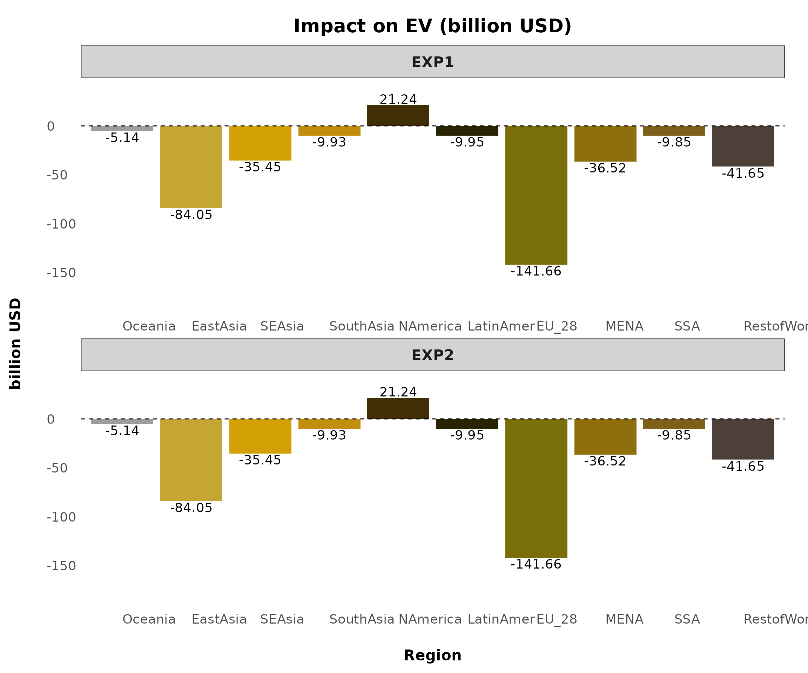
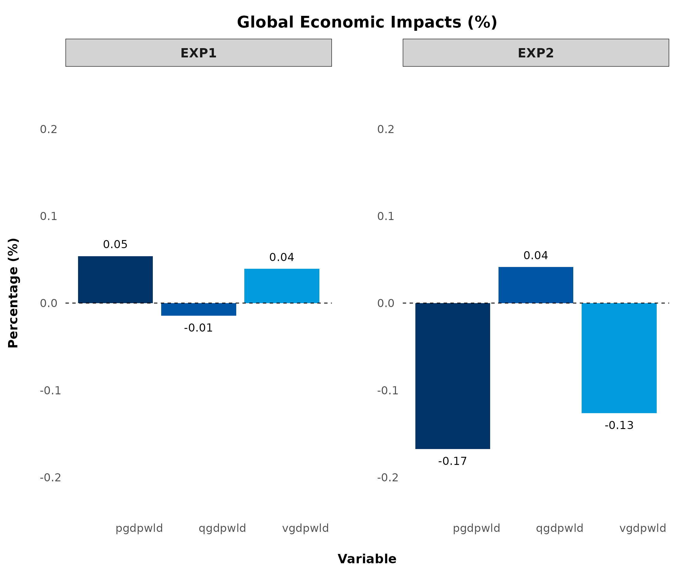
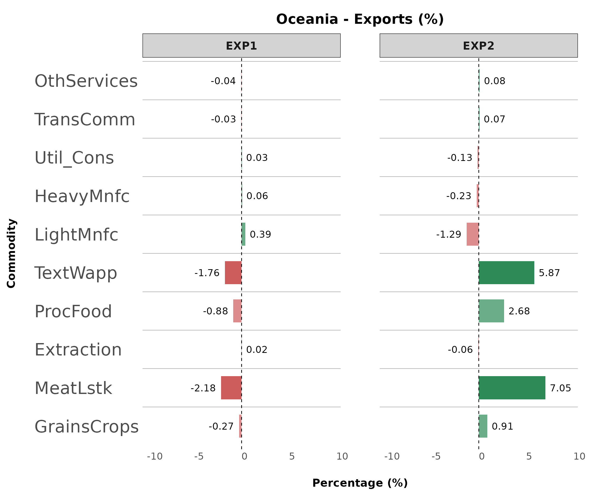
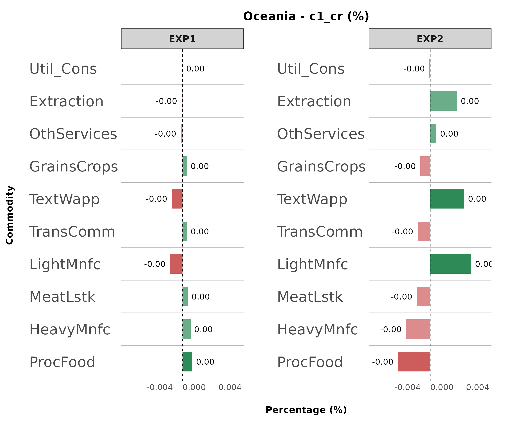
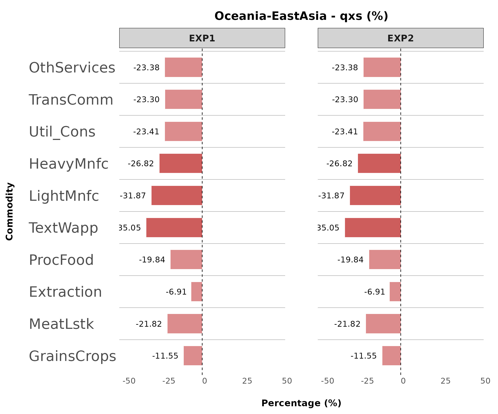
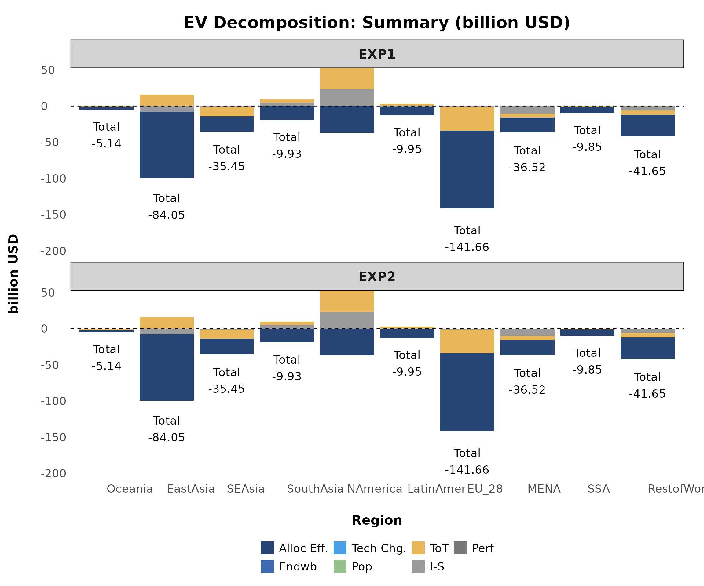
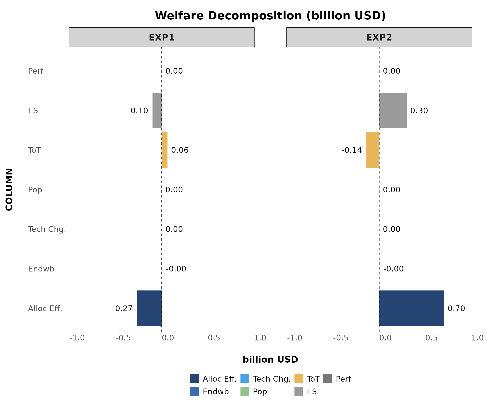
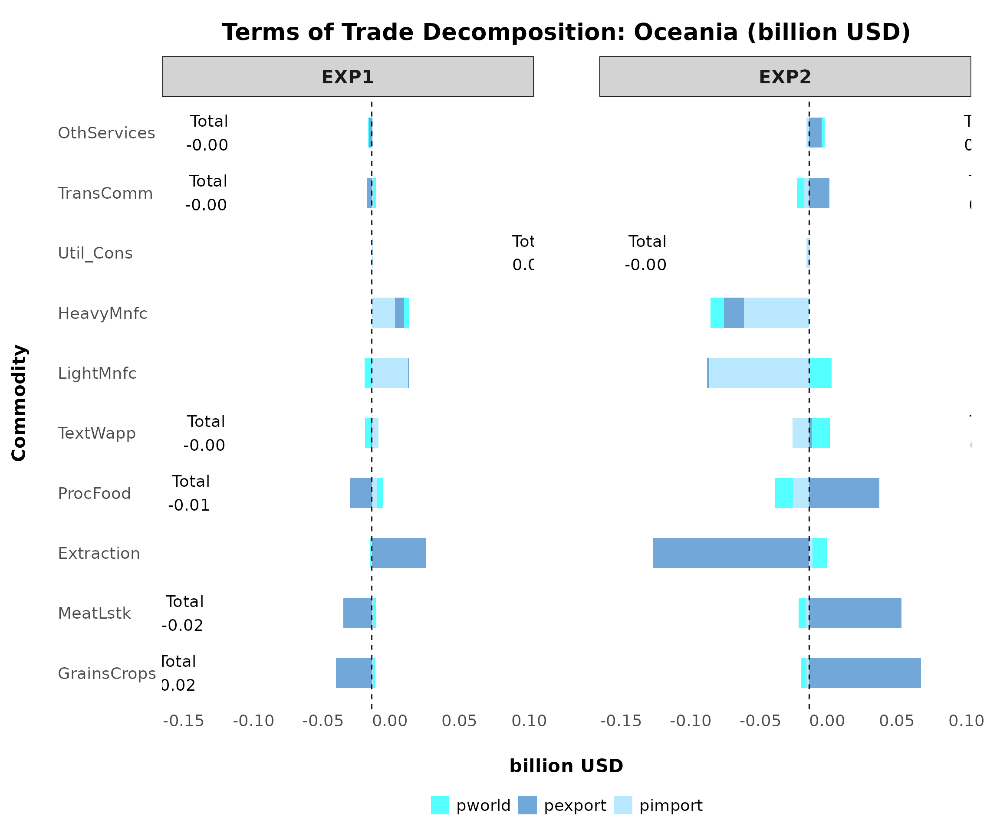
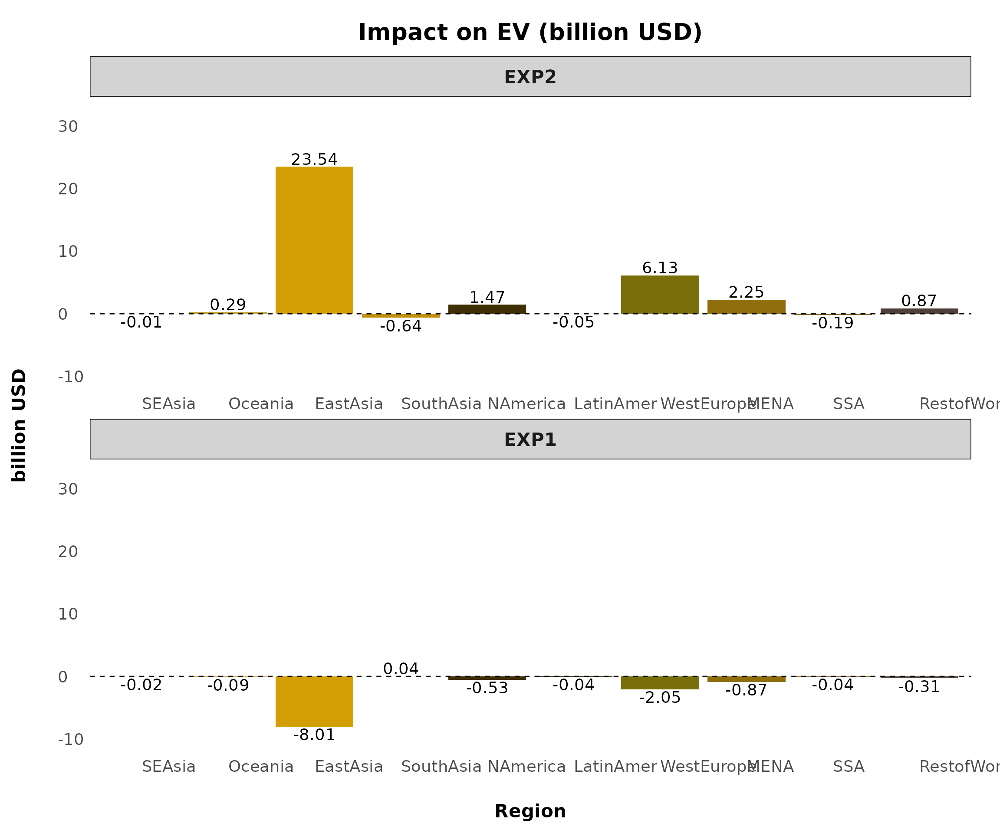

# Plot: A Step-by-Step Guide

This vignette illustrates how to set up plot configurations and generate
outputs.  
For a complete list of available plot types with sample images, see the
[plot
catalog](https://pattawee.shinyapps.io/gtapviz-advanced-plot-configs/).

## Comparison Plot

This figure compares one or multiple variables across all experiments
for selected observations from a chosen dimension (e.g., region,
sector).

**Key Features**

- Designed for comparing selected variables across experiments.

- Displays all selected variables in one plot, making it ideal for a few
  observations; too many can make it dense and unclear.

### Example 1

Plotting `qgdp`, `ppriv`, `EV`, `tot`, and `u` generates six separate
figures using the following command:

``` r
reg_data = sl4.plot.data[["REG"]]

plotA <- comparison_plot(
          # === Input Data ===
          data         = reg_data,
          filter_var   = NULL,
          x_axis_from  = "Region",
          split_by     = "Variable",
          panel_var    = "Experiment",
          variable_col = "Variable",
          unit_col     = "Unit",
          desc_col     = "Description",
        
          # === Plot Behavior ===
          invert_axis     = FALSE,
          separate_figure = FALSE,
        
          # === Variable Display ===
          var_name_by_description = FALSE,
          add_var_info            = FALSE,
        
          # === Export Settings ===
          output_path     = NULL,
          export_picture  = FALSE,
          export_as_pdf   = FALSE,
          export_config   = create_export_config(
            width  = 20,
            height = 12
          ),
        
          # === Styling ===
          plot_style_config = create_plot_style(
            color_tone         = "purdue",
            add_unit_to_title  = TRUE,
            title_format       = create_title_format(
              type = "prefix",
              text = "Impact on"
            ),
            panel_rows = 2
          )
        )
```



(splt_by = FALSE, panel_rows = 2, panel_cols = NULL i.e., default)

Comparison Plot Visualization  

### GTAP Macro Variable Plot

This figure displays aggregated values across all experiments, typically
for global economic impacts. It is designed for GTAP Macro variables
extracted from the *“Macros”* header.

**Key Features**

- Compares macroeconomic indicators across experiments.

- Works with aggregated data, making it ideal for global-scale analysis.

- Primarily used for GTAP Macro variables but can be applied to other
  aggregated datasets.

To plot this figure—the only difference from previous figures is
changing `split_by = FALSE`—you can use the following command:

``` r
macro.plot <- comparison_plot(
  # === Input Data ===
  data         = macro.data[["macros"]],
  filter_var   = c("pgdpwld", "qgdpwld", "vgdpwld"),
  x_axis_from  = "Variable",
  split_by     = FALSE,     # THIS IS THE MOST IMPORTANT PART FOR THIS PLOT

  # === Export Settings ===
  output_path     = NULL,
  export_picture  = FALSE,
  export_as_pdf   = FALSE,
  export_config   = create_export_config(
    width  = 20,
    height = 15
  ),

  # === Styling ===
  plot_style_config = create_plot_style(
    color_tone = "gtap",
    title_format = create_title_format(
      type = "full",
      text = "Global Economic Impacts"
    )
  )
)
```



GTAP Macro Plot Visualization  
(splt_by = FALSE, panel_rows and panel_cols = NULL i.e., default)

## Detail Plot

This figure visualizes large-scale data, displaying all sectors (*COMM*,
*ACTS*) or all regions (*REG*) within each experiment.

**Key Features**

- Supports visualization across two selected dimensions.

- Suitable for datasets too large for *comparison_plot*.

- Automatically detects and aligns variables with different dimension
  names.

- Filters data by selecting the most affected variables using
  **top_impact**.

### Example 1

The following command plots all variables with sectors on the x-axis for
each region:

``` r
sector_data <- sl4.plot.data[["COMM*REG"]]

plotB <- detail_plot(
  # === Input Data ===
  data        = sector_data,
  filter_var  = list(Region = c("Oceania")),
  x_axis_from = "Commodity",
  split_by    = "Region",
  panel_var   = "Experiment",
  variable_col = "Variable",
  unit_col     = "Unit",
  desc_col     = "Description",
  
  # === Plot Behavior ===
  invert_axis      = TRUE,
  separate_figure  = FALSE,
  top_impact       = NULL,
  
  # === Variable Display ===
  var_name_by_description = TRUE,
  add_var_info            = FALSE,
  
  # === Export Settings ===
  output_path     = NULL,
  export_picture  = FALSE,
  export_as_pdf   = FALSE,
  export_config   = create_export_config(
    width  = 45,
    height = 20
  ),
  
  # === Styling ===
  plot_style_config = create_plot_style(
    positive_color = "#2E8B57",
    negative_color = "#CD5C5C",
    panel_rows = 1,
    panel_cols = NULL,
    show_axis_titles_on_all_facets = FALSE,
    y_axis_text_size = 25,
    bar_width = 0.6,
    all_font_size = 1.1
  )
)
```

💡 Tip

You may notice the following adjustments:

- `positive_color` and `negative_color`: Define colors for positive and
  negative values, automatically distinguishing impacts by shade.

- `show_axis_titles_on_all_facets`: Suppresses repeated labels across
  facets.

- `y_axis_text_size`: Increases y-axis label size to 25 from the default
  setting.

- `bar_width`: Decreases bar width for better visualization of large
  datasets.

- `all_font_size`: Increases all font sizes to 1.3 from the default
  setting.



Detail Plot Visualization  
(top_impact = NULL, invert_axis = TRUE, panel_rows = 1)

### Example 2

Another powerful feature of `detail_plot` is the `top_impact`
argument,  
which automatically filters and displays the most-affected values (both
gains and losses)  
based on the `x_axis_from` grouping.



Detail Plot Visualization (filtered)  
(top_impact = 10, invert_axis = TRUE)

------------------------------------------------------------------------

### Example 3

Another example involves plotting multi-dimensional data like bilateral
trade (`qxs`).  
To do this, specify:

- `split_by = c("Source", "Destination")`

This automatically generates separate plots for each unique pair, e.g.,
`"Oceania-SEAsia"`, `"Oceania-EastAsia"`, etc.

Each plot shows detailed impacts at the sector (`COMM`) level for that
country pair.

``` r
bilateral_data <- bilateral_data[["qxs"]]

plotB3 <- detail_plot(
  # === Input Data ===
  data        = bilateral_data,
  filter_var  = list(Source = c("Oceania"),
                     Destination = c("SEAsia", "EastAsia")),
  x_axis_from = "Commodity",
  split_by    = c("Source", "Destination"),    # The most important part!
  
  # === Plot Behavior ===
  invert_axis      = TRUE,
  separate_figure  = FALSE,
  top_impact       = NULL,
  
  # === Variable Display ===
  var_name_by_description = FALSE,
  add_var_info            = FALSE,
  
  # === Export Settings ===
  output_path     = NULL,
  export_picture  = FALSE,
  export_as_pdf   = FALSE,
  export_config   = create_export_config(
    width  = 45,
    height = 20
  ),
  
  # === Styling ===
  plot_style_config = create_plot_style(
    positive_color = "#2E8B57",
    negative_color = "#CD5C5C",
    panel_rows = 1,
    panel_cols = NULL,
    show_axis_titles_on_all_facets = FALSE,
    y_axis_text_size = 25,
    bar_width = 0.6,
    all_font_size = 1.1
  )
)
```



Detail Plot Visualization (filtered)  
(top_impact = 10, invert_axis = TRUE)

## Stack Plot

This plot visualizes decomposition results, showing how different
components contribute to a total value, making it particularly suitable
for decomposition analysis.

**Key Features**

- Displays the contribution of components to a total value.

- Allows further decomposition by unstacking components instead of using
  a stacked bar.

- Suitable for welfare decomposition, trade decomposition, and other
  GTAP structural breakdowns.

💡 Tip

Since decomposition data often contains multiple components, **renaming
and restructuring** may be necessary before plotting. You can try the
following code:

``` r
# Rename Value if needed
wefare.decomp.rename <- data.frame(
  ColumnName = "COLUMN",
  OldName = c("alloc_A1", "ENDWB1", "tech_C1", "pop_D1", "pref_G1", "tot_E1", "IS_F1"),
  NewName = c("Alloc Eff.", "Endwb", "Tech Chg.", "Pop", "Perf", "ToT", "I-S"),
  stringsAsFactors = FALSE
)

har.plot.data <- rename_value(har.plot.data, mapping.file = wefare.decomp.rename)
```

### Example 1

You can use the following command to plot the decomposition figure:

``` r
plotC <- stack_plot(
  # === Input Data ===
  data              = har.plot.data[["A"]],
  filter_var        = NULL,
  x_axis_from       = "Region",
  stack_value_from  = "COLUMN",
  split_by          = FALSE,
  panel_var         = "Experiment",
  variable_col      = "Variable",
  unit_col          = "Unit",
  desc_col          = "Description",

  # === Plot Behavior ===
  invert_axis     = FALSE,
  separate_figure = FALSE,
  show_total      = TRUE,
  unstack_plot    = FALSE,
  top_impact      = NULL,

  # === Variable Display ===
  var_name_by_description = TRUE,
  add_var_info            = FALSE,

  # === Export Settings ===
  output_path     = NULL,
  export_picture  = FALSE,
  export_as_pdf   = FALSE,
  export_config   = create_export_config(
    width  = 28,
    height = 15
  ),

  # === Styling ===
  plot_style_config = create_plot_style(
    color_tone                   = "gtap",
    panel_rows                   = 1,
    panel_cols                   = NULL,
    show_legend                  = TRUE,
    show_axis_titles_on_all_facets = FALSE
  )
)
```



Stack Plot Visualization (stack)  
(split_by = FALSE, show_total = TRUE, unstack_plot = FALSE)

### Example 2

To further analyze the decomposition at the component level, set
`unstack_plot = TRUE` to display unstacked plots.



Stack Plot Visualization (unstacked)  
(split_by = FALSE, invert_axis = TRUE, unstack_plot = TRUE)

### Example 3

Another practical example is plotting the decomposition of terms of
trade (header E1), which is also a good example of multi-dimensional
plotting. You may try the following command:

``` r
plotE <- stack_plot(
  # === Input Data ===
  data              = har.plot.data[["E1"]],
  filter_var        = list(Region = c("Oceania", "SEAsia")),
  x_axis_from       = "Commodity",
  stack_value_from  = "PRICES",
  split_by          = "Region",
  panel_var         = "Experiment",
  variable_col      = "Variable",
  unit_col          = "Unit",
  desc_col          = "Description",

  # === Plot Behavior ===
  invert_axis     = TRUE,
  separate_figure = FALSE,
  show_total      = TRUE,
  unstack_plot    = FALSE,
  top_impact      = NULL,

  # === Export Settings ===
  output_path     = NULL,
  export_picture  = FALSE,
  export_as_pdf   = FALSE,
  export_config   = create_export_config(
    width  = 50,
    height = 30
  ),

  # === Styling ===
  plot_style_config = create_plot_style(
    title_format = create_title_format(
      type = "prefix",
      text = "Terms of Trade Decomposition",
      sep  = ": "
    ),
    color_tone                   = "winter", 
    panel_rows                   = 1,
    show_axis_titles_on_all_facets = FALSE,
    bar_width                    = 0.5,
    show_legend                  = TRUE
  )
)
```



Stack Plot Visualization (Multi-Dimension)  
(split_by = “Region”, plot_style_config -\> adjustments)

## Tip

### Plot Configurations

- Run the following chunks to view all available configurations.

``` r
get_all_config()
```

- Rename the list outputs `my_export_config` and `my_style_config` to
  any names you prefer; you can create as many styles as needed.

- Enter the name of your custom style list into the plot function, while
  other settings in `(...)` remain unchanged, as shown in the sample
  below:

``` r
comparison_plot <- (...,
                    export_config = my_export_config,
                    plot_style_config = my_style_config
                    )
```

### Sorting Output

This function allows you to sort data before generating plots or
tables.  
For example, you can display `EXP2` before `EXP1`, or `SEAsia` before
`Oceania`.

It supports:

- Sorting by multiple columns simultaneously for precise output
  control  
- Applying consistent sorting across all data frames within a data list

See
[`?sort_plot_data`](https://pattawee-pp.com/GTAPViz/reference/sort_plot_data.md)
for full details.

Key arguments:

- `cols` specifies the column(s) to sort based on a predefined order
  (e.g., in `sl4.plot.data`, `Experiment` and `Region` will follow the
  defined order).

- `sort_by_value_desc` controls whether sorting is in descending order
  (`TRUE/FALSE/NULL`).

To apply sorting, use the following command:

``` r
# Using the function
sort_sl4_plot <- sort_plot_data(
  sl4.plot.data,
  sort_columns = list(
    Experiment = c("EXP2", "EXP1"), # Column Name = Sorting Order
    Region = c("SEAsia", "Oceania")
    ),
  sort_by_value_desc = NULL
)
```



### Renaming Values

To automatically modify values in any column before plotting—such as
renaming country names in the `REG` column (e.g., changing `"USA"` to
`"United States"` or `"CHN"` to `"China"`)—use the following command:

``` r
# Creating Mapping File
rename.region <- data.frame(
  ColumnName = "REG",
  OldName = c("USA", "CHN"),
  NewName = c("United States", "China"),
  stringsAsFactors = FALSE
)

sl4.plot.data_rename <- rename_value(sl4.plot.data, mapping.file = rename.region)
```

  
Another useful example is renaming the components of welfare
decomposition before plotting.

``` r
# Rename Value if needed
wefare.decomp.rename <- data.frame(
  ColumnName = "COLUMN",
  OldName = c("alloc_A1", "ENDWB1", "tech_C1", "pop_D1", "pref_G1", "tot_E1", "IS_F1"),
  NewName = c("Alloc Eff.", "Endwb", "Tech Chg.", "Pop", "Perf", "ToT", "I-S"),
  stringsAsFactors = FALSE
)

welfare_decomp <- rename_value(har.plot.data, mapping.file = wefare.decomp.rename)
```

## Sample Data

Sample data used in this vignette is obtained from the GTAPv7 model and
utilizes data from the GTAP 11 database. For more details, refer to the
[GTAP Database
Archive](https://www.gtap.agecon.purdue.edu/databases/archives.asp).
